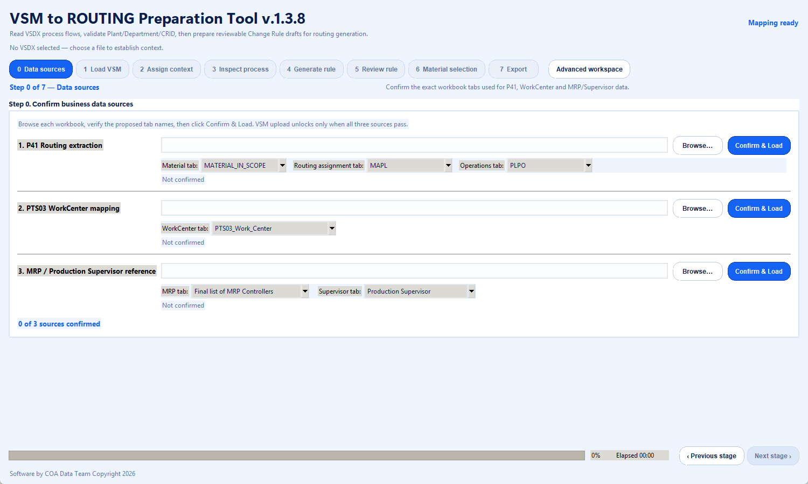

# VSM to ROUTING Preparation Tool


VSM to ROUTING Preparation Tool v1.3.8 is a Windows desktop application that reads Visio process maps and supporting Excel extracts, then prepares reviewable first drafts for routing Change Rules and Material Selection.

The tool supports manufacturing analysts during preparation. It does not approve routing decisions, update SAP, or replace the manufacturing process owner.



## What the application does

- Reads one or more `.vsdx` files directly from their XML package structure.
- Detects pages, process shapes, connectors and workcentre codes.
- Assigns each VSM file to a Plant, suggests a cleaned CRID from each tab name, and requires user confirmation before generation.
- Builds draft Change Rule rows from the visual process order and the confirmed workcentre reference.
- Flags missing old workcentres, ambiguous mappings, sequence gaps and other review conditions.
- Preserves analyst edits during selective reruns when the merge policy is selected.
- Combines confirmed routing, MRP Controller and Production Supervisor sources to prepare Material Selection candidates.
- Saves and restores `.vpa` analysis packages.
- Exports selected, Plant-level or consolidated Excel packages for review.

## Guided manufacturing workflow

The main interface uses eight gated stages. A stage unlocks only when its required inputs are ready.

| Stage | Purpose |
| --- | --- |
| 0. Data sources | Select the three reference workbooks and explicitly confirm the sheets to load. |
| 1. Load VSM | Add Visio files and assign each file to a Plant. |
| 2. Assign context | Select the VSM/Plant, review discovered WorkCenters by tab and count, then confirm each suggested Department/CRID. |
| 3. Inspect process | Review detected shapes, connectors, workcentres and visual order. |
| 4. Generate rule | Prepare Change Rule drafts for one CRID, a Plant or all loaded Plants. |
| 5. Review rule | Resolve rows marked Review Required and validate readiness. |
| 6. Material selection | Generate candidate material and routing combinations from the confirmed sources. |
| 7. Export | Produce Change Rule, Material Selection or consolidated review packages. |

Advanced workspace exposes the complete multi-pane interface for experienced analysts without bypassing validation.

## Required business inputs

The repository intentionally contains no operational workbooks or VSM files. Users provide their own files at run time and confirm the intended sheet before the application reads it.

### P41 routing extraction

The default sheet names are `MATERIAL_IN_SCOPE`, `MAPL` and `PLPO`.

- Material scope requires `MATNR`, `WERKS`, `DISPO` and `FEVOR`.
- Routing assignment requires `MATNR`, `WERKS`, `PLNNR` and `PLNAL`.
- Operations require `MATNR`, `WERKS`, `PLNNR`, `PLNAL`, `VORNR` and `ARBPL`.

### PTS03 workcentre reference

The selected sheet must provide Plant (`WERKS` or `PLANT`), new workcentre (`ARBPL`, `NEW WC` or `WORK CENTER`) and old workcentre (`OLD WC` or `OLD WORK CENTER`). Description and control-key fields are optional.

### MRP Controller and Production Supervisor reference

The user selects one MRP sheet and one Production Supervisor sheet. Each must contain a recognizable Plant column plus its corresponding code column.

### Optional Department and Plant mapping

The expert workspace can load a mapping from an Excel sheet containing Department or CRID, Plant and Work Center columns, or from a text file such as [the synthetic example](examples/Department_Plant_List_Sample.txt). Guided Step 2 does not present those records as established CRID ownership before the user confirms the VSM context.

## Step 2 evidence and CRID confirmation

Step 2 begins with **VSM files and plant assignment**. Selecting a file populates a discovery table immediately below it with every recognized WorkCenter, the VSM tab/page where it appears, and its occurrence count.

The **Suggested** CRID comes only from the tab/page name. Common status phrases such as `Complete`, `Working`, `In Progress`, and `In Process`, plus common date formats, are removed before conversion to lowercase `snake_case`. For example, `Bearing Assembly - Complete` becomes `bearing_assembly`, and `Fab+Lining 2026-09-11 - Working` becomes `fab_lining`.

The confirmed PTS03 WorkCenter source expands the scanner's recognition vocabulary, but it does not auto-assign a Department/CRID. The user must confirm the suggestion with **Apply** before Change Rule generation can use it.

## Draft Change Rule fields

Exports use this order:

`CRID | PLANT | ALTERNATE | SEQUENCE | SUBSEQ | OLD WC | NEW WC | OP_DESCRIPTIONS | RULE TYPE | COLUMN`

`NEW WC` comes from VSM shape text. `OLD WC` comes from the confirmed reference workbook. `SEQUENCE` and `SUBSEQ` restart within each Department/CRID. The application follows connector direction for functional process order (including snake layouts), groups parallel operations under one SEQUENCE with consecutive SUBSEQ values, and uses page geometry only when the connector flow is incomplete. Ambiguous branches remain visible for human review.

## Install and run from source

Requirements:

- Windows 10 or later
- Python 3.11 or 3.12
- Microsoft Visio only for the optional Exact Visio Preview

Clone the repository, then double-click `setup_and_run.bat`. To run manually:

```powershell
py -3 -m venv .venv
.\.venv\Scripts\Activate.ps1
python -m pip install -r requirements.txt
python main.py
```

The application stores interface preferences locally. It does not upload the selected business files.

## Build the portable Windows application

Double-click `build_portable.bat`, or run:

```powershell
powershell -ExecutionPolicy Bypass -File .\build_portable.ps1
```

PyInstaller writes the executable to `dist\VSM_to_ROUTING_Preparation_Tool_v1.3.8.exe`. Reference workbooks and VSM files are not embedded in the executable. Users select them at run time.

## Presentation

The [v1.3.8 simulated walkthrough](docs/VSM_to_ROUTING_Preparation_Tool_v1.3.8_Simulated_Walkthrough.pptx) documents the eight-stage workflow using a review-only example.

## Important limitations

- Generated rows are first drafts and require manufacturing-owner review.
- Visual order may differ from business sequence when a VSM has missing connectors, alternate paths or implicit decisions.
- Material Selection accuracy depends on the confirmed source sheets and department-specific business rules.
- The application does not connect to SAP or write to a production system.

## Repository data policy

Real routing extracts, VSM files, mappings, analysis packages and generated Excel outputs are excluded from version control. The `.gitignore` blocks the common business-data formats used by the workflow.

Software by COA Data Team. Copyright 2026.

No open-source licence is granted by this repository.
